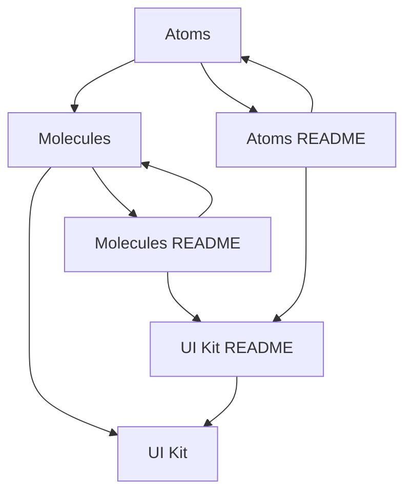
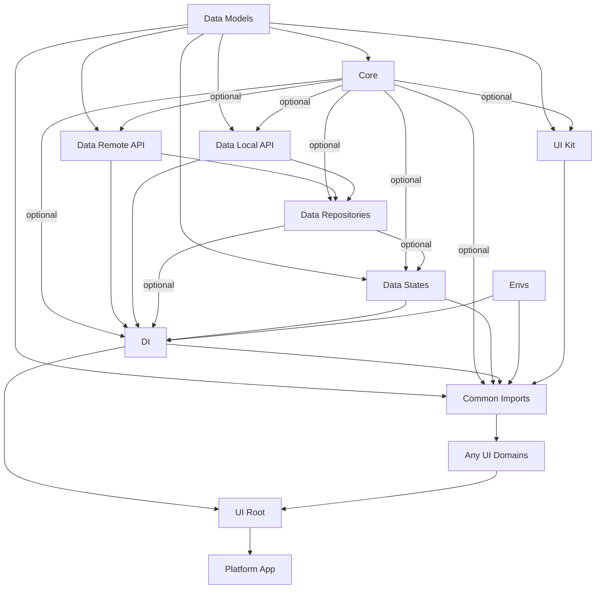
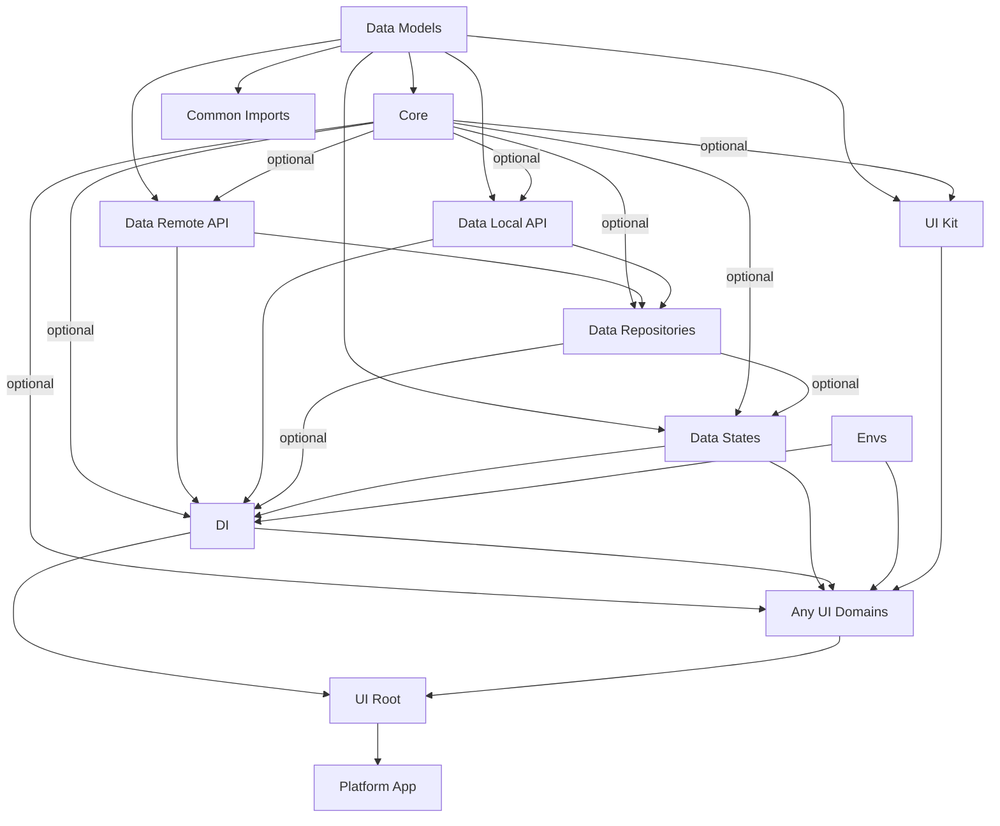
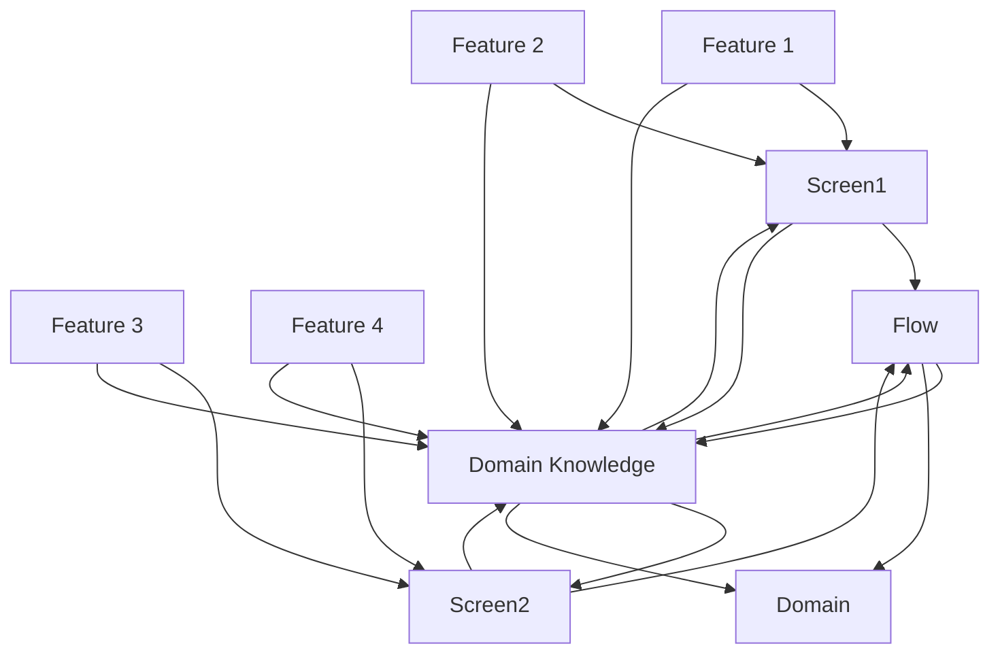

AI-centric архитектура Flutter-приложения (и не только) для небольших стартапов

**Short description:** Мысли о масштабируемой архитектуре приложений через кодовую структуру и философии «developer as a user»; подходит для indie-разработчиков и стартапов на ранних стадиях.

disclaimer: хотя статья была написана в начале 25 года, за исключением некоторых вещей на мой взгляд, архитектурные паттерны не потеряли актуальности, и поэтому, многие паттерну все ещё также актуальны и это то, что использую на практике.

**v1 Как серия статей.**

В серии статей я хотел бы поделиться своими мыслями о том, как структурировать codebase и использовать различные подходы для масштабирования архитектурной структуры на разных этапах роста продукта.

**v2 Как одиночная статья.**

В этой статье я хотел бы поделиться своими мыслями о том, как структурировать код и использовать различные подходы на разных этапах роста продукта.


**Note:** Все мои мысли основаны на личном опыте, полученном в результате принятия определенных решений и наблюдения за тем, какие из них со временем оправдали себя, а какие провалились. Это моя рефлексия о том, что можно сделать и как, а не строгие guidelines для исполнения — скорее источник вдохновения для адаптации.

Это может в некоторых случаях дополнять (или нет) общие подходы к разработке, особенно в крупных компаниях или недавно опубликованное потрясающее руководство [https://docs.flutter.dev/app-architecture](https://docs.flutter.dev/app-architecture). Вместо этого я сосредоточусь только на ранних стадиях стартапа — для тех, кто начинает свой путь с одного Flutter-разработчика и ищет способ масштабироваться до нескольких (скажем, пяти-шести) разработчиков в компании, когда возникнет необходимость.

**Second Note:** Пути продуктовой разработки (product development) и разработки под заказ в студиях (ordered product in-studio) могут кардинально отличаться, поэтому мой совет — пропускайте этапы при необходимости, сопоставляя их со своим личным опытом.

**Third Note:** На протяжении текста я буду относиться к разработчику как к пользователю (developer as a user) — представьте кодовую структуру проекта через структуру папок и файлов, именно так, как большинство разработчиков смотрят на свой код. Для меня стало большим открытием, что это самый удобный способ передать свою работу на обслуживание (maintenance) или для внесения фич-изменений (feature changes). Частью этого открытия был просмотр видео о Clean Architecture и Design [https://youtu.be/Nsjsiz2A9mg?si=LDSqhU_6DlyyVL1K&t=527](https://www.google.com/search?q=https://youtu.be/Nsjsiz2A9mg%3Fsi%3DLDSqhU_6DlyyVL1K%26t%3D527), другими частями стали Domain-Driven Design (DDD) [https://en.wikipedia.org/wiki/Domain-driven_design](https://en.wikipedia.org/wiki/Domain-driven_design), Test-Driven Development (TDD) и просто рутина разработки, и я надеюсь продолжить этот путь дальше:)

Проще говоря, вы определяете структуру кода, которая декларирует, как ваш код будет взаимодействовать, а затем применяете к ней предпочитаемые вами архитектурные паттерны.

**Fourth Note:**


По состоянию на 27 января 2025 года очевидно, что многие разработчики используют AI-инструменты для объяснения кода или быстрого прототипирования решений. Поэтому, когда упоминается термин 'prompt', это относится к сохраненному вопросу или ответу, сгенерированному AI-инструментом в текстовом формате.

**Fifth Note:**


Перед началом разработки или на любом этапе:
Создайте свои собственные AI preferences / agent-rules для вашего любимого AI-инструмента и project-wide preferences, чтобы другие разработчики могли использовать их в будущем. Например, если вы используете Cursor, вы можете найти полезные правила на [https://cursor.directory](https://cursor.directory).
Имейте в виду, что это всегда должно быть частью вашей архитектуры — вы будете итерировать над этими правилами, откатывать их, писать, переписывать, тестировать и т. д. Так что относитесь к этому просто как к части вашего codebase.

В то же время, поскольку это довольно новый подход, использование этой техники является довольно экспериментальным и может приводить к непредсказуемым результатам. Будьте осторожны и всегда полагайтесь на свои навыки.

**Sixth Note: Терминология.**


Давайте определим значения нескольких ключевых терминов (хотя их много, нам нужно сосредоточиться на этих, чтобы обеспечить четкий контекст для заметок):

**End user** — конечный пользователь, который использует приложение на любой доступной платформе: iOS, Android, macOS, Windows, Linux, web и т. д.

**Domain** — логически определенная и ограниченная своей предметной областью (scope) часть вашего приложения, определяемая опытом конечного пользователя (end user experience) в сочетании с функциональностью приложения.

[https://en.wikipedia.org/wiki/Domain_(software_engineering](https://en.wikipedia.org/wiki/Domain_(software_engineering))

*Пример сложного приложения (Complex App Example):*


Представьте финансовое приложение, где вы — end user.
Вы можете ожидать следующие логические домены:

* **(Intro)** Руководство по использованию приложения (Guide), викторина (quiz) или новости — некоторые экраны, которые могут появляться до появления Home.


* **(Home)** Специфично для функционала рабочего стола, наиболее частые фичи, которые использует пользователь. Этот домен может использовать или не использовать фичи из других доменов. Поскольку пользователь ожидает, что пользоваться им можно будет быстро, давайте назовем это fast functions experience.


* **(Payments)** — вы можете ожидать, что главный экран ведет на другие экраны, такие как провайдеры банков, цифровые переводы и т. д... но все эти экраны будут логически привязаны к одной теме (scope) payment experience.


* **(Profile)** End user может ожидать, что он может войти/выйти (sign in / sign out), удалить свой аккаунт, перейти в настройки конфиденциальности, проверить документы. Давайте назовем это profile experience.


* **(Support)** Этот домен может иметь экран с чатом, он может содержать разные диалоги на разных экранах, но в то же время все они будут определять предмет support experience.


Чтобы разработать каждый домен, вам придется зафиксировать, как конечные пользователи, эксперты или специалисты проживают этот опыт, либо пережить его самому.
Иными словами — вам придется определить и исследовать domain knowledge.

**Domain knowledge** — «знание конкретной дисциплины», полученное от доменных экспертов/специалистов через аналитику, дизайнеров или путем итеративного дизайна, собственного опыта или работы. В нашем случае это будет опыт конечного пользователя (end user), использующего ваше приложение.
[https://en.wikipedia.org/wiki/Domain_knowledge](https://en.wikipedia.org/wiki/Domain_knowledge)

**Flow** — один экран или серия экранов, страниц или views, организованных в определенном направлении с точки зрения пользователя. Например — Auth Flow.

**Screen** — виджет, частично или полностью перекрывающий экран, состоящий из фич, размещенных на этой/этом screen / page / view. Лично мне нравится концепция относиться к любому screen как к page или view, который может отображаться на весь экран или быть частью лейаута, строящегося с помощью вложенной навигации (nested navigation: [https://pub.dev/documentation/go_router/latest/go_router/ShellRoute-class.html](https://pub.dev/documentation/go_router/latest/go_router/ShellRoute-class.html)) аналогично тому, как работают JS-фреймворки в веб ([https://router.vuejs.org/guide/essentials/nested-routes](https://router.vuejs.org/guide/essentials/nested-routes)).

**Feature** — «отличительная характеристика программного элемента (например, производительность, портативность или функциональность)». Применительно к домену давайте определим её как узкоспециализированную конкретную возможность/функциональность (capability/functionality), которая в комбинации с другими фичами помогает end user воспринимать домен как единое целое.
[https://en.wikipedia.org/wiki/Software_feature](https://en.wikipedia.org/wiki/Software_feature)

---

## Stage 1 — Prototyping

* **Team:** 1 (или в лучшем случае 2) разработчика


* **Main focus:** разрабатывать быстро и выбрасывать любую часть, которая вам не нравится как ClientUser (или, назовем это, бизнесу).


* Относитесь к своему репозиторию как к верстаку (workbench) — вы не знаете, что сработает, поэтому будьте готовы к нескольким проектам одновременно, даже на разных фреймворках и разных языках.


Я предлагаю следующую структуру папок на этом этапе.

**Abstract code structure**

```
/
├── prototypes
│   ├── {prototype_name}
│   │   ├── idea.md  // This file contains the initial ideas and AI-generated insights for the prototype.
├── prompts
│   ├── agents
│   │   ├── {name}_agent.md  // Rules and guidelines for AI agents used in the project.
│   ├── ideas
│   │   ├── {idea}_gen.md  // Only AI-generated answers - ideas and prompts.
│   │   ├── {idea}.md  // Handwritten notes and domain knowledge. May include AI-generated answers too.

```

**Example code structure**

```
/
├── prototypes
│   ├── flutter/todo_with_amazing_animation
│   │   ├── idea.md
│   ├── typescript/yjs_prototype
│   │   ├── idea.md
│   ├── dart/frog_server
│   │   ├── idea.md
│   ├── just_cool_feature
│   │   ├── idea.md
├── prompts
│   ├── agents
│   │   ├── flutter_agent.md
│   │   ├── flutter_architector_agent.md
│   │   ├── rust_agent.md
│   ├── ideas
│   │   ├── charmed_animated_scroll_gen.md
│   │   ├── that_gradient_shader.md

```

Если вам не нравится слово `prototype`, используйте `playground` или `experiments` — это слово важно, потому что на более поздних этапах вы захотите убедиться, что эти фрагменты можно запустить (playable), даже для новичков, но нельзя перемещать (movable), чтобы ваш git commit не взорвался xD

Каждый прототип должен быть настолько маленьким, насколько это возможно — это может быть от одного до трех файлов, просто чтобы протестировать и прочувствовать вашу идею.
Я бы посоветовал не настраивать строгие lints для этого этапа, чтобы код оставался максимально простым и компактным, но если вы тестируете их или используете новый язык — определенно используйте.

---

## Stage 2 — Main idea or MVP (Minimum Viable Product). Domain iterations.

* **Team:** 1-2 разработчика


* **Main focus:** настроить такую архитектуру, которая будет поддерживать и помогать быстрым итерациям в доменах, и делать их.


Этап, когда у вас есть хотя бы одна идея, и вы собираетесь начать разработку MVP.
И вы снова и снова итерируете по доменам, чтобы найти наилучший (на данный конкретный момент) опыт для конечных пользователей.

### Заметка о linter rules

Странно, но всего пара linter rules — и ваш путь к созданию или ликвидации технического долга задан.

Выбирайте свои linter rules еще до того, как заглянете в код, и выбирайте мудро. Эти правила повлияют не только на вас, но и на ваш AI-generated код, качество кода и технический долг, так как со временем ваш codebase будет расти, и если вы решите изменить всего одно правило, вы можете вызвать огромное количество linter warnings, ошибок и командных дискуссий.

### UI Kit

Этот этап сильно зависит от вопроса: вы абсолютно одинокий разработчик или команда с дизайнером, потому что первое, что нужно сделать — это создать пусть не идеальный, но рабочий `ui_kit`.
Чтобы сделать это, попробуйте изучить различные техники его организации. Лично я предпочитаю использовать как минимум два шага из методологии Atomic Design [https://atomicdesign.bradfrost.com/chapter-2/](https://atomicdesign.bradfrost.com/chapter-2/): `atoms` и `molecules`, но, на мой взгляд, это сильно зависит от того, чего вы рассчитываете достичь с помощью дизайна, для каких платформ разрабатывается продукт и т. д. Для одного продукта это могут быть только `atoms` и `molecules`. Для другого — специфические повторяющиеся паттерны для сложных карточек продуктов, шаблоны лейаутов, шаблоны страниц; для третьего — подход Material, Human Guidelines, FluentUI (обычно в этом случае довольно удобно найти официальный дизайн в Figma, Sketch и т. д.).

Относитесь к этому как к абсолютно автономной библиотеке, чтобы не связывать её с бизнес-требованиями и сосредоточиться на том, насколько удобно её использовать, разрабатывать и поддерживать не только вам, но и другим разработчикам и AI.

Надеюсь, если облечь это в правильные слова — это не означает, что она должна быть идеальной, скорее она должна иметь хорошо документально оформленные README вокруг, объясняющие принципы того, как создавать новый компонент этой библиотеки и делать его полезным.
Из моего опыта критически важно, насколько хорошо вы организуете и определяете таксономию, документацию и удобство — это повлияет на любое решение любого разработчика в будущем, на то, насколько быстро вы сможете итерировать (разрабатывать новое, поддерживать, чинить и изменять старое) для фич, экранов и т. д.

**Пример взаимосвязей и workflow UI Kit**



Затем создайте базовую структуру кода приложения:

```
/
├── core // everything that is not API, data, state, and ui. May contain isolated business logic, but not tied to any specific domain.
│   ├── utils  // Utility functions, some duplicate isolated logic that is more related to the framework than the app, such as serialization, etc.
│   ├── extensions  // Extensions for types.
│   ├── hooks  // Optional hooks for logic duplication reduction. Usually handy for small portions of logic that are used in build methods.
│   ├── l10n  // Optional localization files.
│   ├── side_services  // Optional third-party services like Firebase, Analytics, etc.
├── data_local_api  // I use word API, as it is just shorter:) but it has the same meaning as services, sources). Prefer to treat it as your local backend server.
├── data_remote_api  // (services, sources) Remote APIs, preferably generated from backend schemas (REST or GraphQL or any other).
├── data_repositories  // (optional) Handles both local and remote APIs.
├── data_models
│   ├── api_dto  // (optional) Data Transfer Objects for APIs. Preferably generated for remote APIs, can be useful for local APIs too.
│   ├── {domain}_models  // (optional) Domain-specific models.
├── data_states  // Global level states for runtime data (notifiers, controllers, blocs, commands, etc.). Its purpose mostly to keep runtime data prepared to use in UI. These states can be used in all domains.
├── di  // Dependency injection setup (it may be provider, get_it, inherited_models, etc.). Will be available for all domains in the app. Here you can set up API, states + methods to initialize them and use in `ui_root`.
├── ui_root  // Place here everything that is needed for the app to start: bootstrap methods, data_state and side_services initialization, error catching (Firebase, Sentry), Analytics, etc.
├── ui_kit // uses below two Atomic Design principles: atoms and molecules, but you can use any other principles, such as Material, Human Guidelines, FluentUI, etc.
│   ├── UI_KIT_README.md  // Short Rules and main principles defining how and why you made certain choices in underlying structure and links to the underlying READMEs. The last part is important, because as I found out, AI tools like to use README for designing or development.
│   ├── atoms
│   │   ├── ATOM_README.md  // Domain knowledge for atoms.
│   ├── molecules
│   │   ├── MOLECULE_README.md  // Domain knowledge for molecules.
├── ui_{domain} // all ui domains
│   ├── {DOMAIN}_KNOWLEDGE.md  // Domain knowledge for the specific UI domain.
│   ├── {flow} // one or more screens or views united into one flow. Every flow has one entry point screen (or at least one) and every screen has one or more features.
│   │   ├── {flow}_screen.dart  // Entry point for the flow.
│   │   ├── {feature_name}  // Domain and flow-specific features.
├── envs.dart  // [Environment variables](https://codewithandrea.com/tips/dart-define-from-file-env-json/)
├── router.dart  // Your preferred router setup with defined routes
├── {platform}_app.dart  // Entry point for the platform-specific app.
├── common_imports.dart  // Optional. Place here all imports that are used in the whole app. Also, it is handy to place here all exports from barrel files from each top folder.

```

И наконец, создайте домены `ui_{domains}`, которые будут включать в себя наиболее критичный опыт приложения, и итерируйте над ними.

### Заметка о UI Domains

Схематичный пример того, чем можно делиться, а чем нельзя внутри домена. Внутри домена вы можете работать с различными типами data layer, screen states, widget states (во Flutter это называется Ephemeral state [https://docs.flutter.dev/data-and-backend/state-mgmt/ephemeral-vs-app#ephemeral-state](https://www.google.com/search?q=https://docs.flutter.dev/data-and-backend/state-mgmt/ephemeral-vs-app%23ephemeral-state)), некоторой бизнес-логикой, специфичными для фичи моделями, которые вы никогда не планируете расшаривать с другими доменами.
Я предлагаю небольшое решение для управления связями между доменами — переиспользуйте только виджеты (flows, screens, features), не переиспользуйте/не расшаривайте данные (data). Если вам нужно поделиться чем-то из локального data layer домена — переместите это в global data layer, откуда это станет доступно для всех доменов. Например, локальная модель может перейти в `data_models`, состояние экрана может быть рефакторено и перейти в `data_states`.

Слово о `data_state` — документация Flutter называет это App State [https://docs.flutter.dev/data-and-backend/state-mgmt/ephemeral-vs-app#app-state](https://www.google.com/search?q=https://docs.flutter.dev/data-and-backend/state-mgmt/ephemeral-vs-app%23app-state). Иными словами, вы можете определить это как global-level states для runtime-данных (notifiers, controllers, blocs, commands и т. д.). Их цель — в основном держать runtime-данные подготовленными для использования в UI. Эти состояния могут использоваться во всех доменах.

Теперь вернемся к глобальной структуре проекта.

### Связи между глобальными слоями (Relations between global layers)

**Option 1 — с common_imports**



**Option 2 — без common_imports**



**Note. Barrel file.**


Мне кажется очень удобным создавать barrel files в каждой верхней папке, экспортируя лежащие ниже классы таким же образом, как Dart делает это для экспорта пакетов [https://dart.dev/tools/pub/create-packages](https://dart.dev/tools/pub/create-packages). Это делает будущий рефакторинг проще и дает возможность не путаться с изменениями в git, когда какой-то файл позже перемещается.
Также эта практика позволяет легче относиться ко всем глобальным папкам как к packages / libraries, которые независимы и могут менять свое содержимое, внутреннюю структуру, но сохранять согласованность со своим внешним API.
В то же время на данный момент у меня нет опыта в том, как это влияет на возможность использования deferred imports [https://dart.dev/language/libraries#lazily-loading-a-library](https://www.google.com/search?q=https://dart.dev/language/libraries%23lazily-loading-a-library). Я думаю, вы как минимум можете ожидать, что это не повлияет на данном этапе, но поскольку это способ загрузки библиотек — это может стать более эффективным на Stage 4.

**Second note. Domain Knowledge.**

**Пример взаимосвязей UI Domain и workflow**



Опционально я рекомендую попробовать размещать файл Domain Knowledge во всех папках data и ui слоев. Он должен быть достаточно простым, чтобы его можно было регенерировать и итерировать с помощью AI — это может дать вам контекст для работы с фичами конкретного домена, для разработки или поддержки.

Семантически, чтобы облегчить получение этого контекста и навигацию, было бы здорово, если бы вы выровняли его с именем вышестоящей папки, например:
Если папка выше — `ui_guide`, то ниже вы можете разместить файл `UI_GUIDE_CONTEXT.md` или `UI_GUIDE_KNOWLEDGE.md`. Причина проста: когда вы используете поиск по файлам — вы сможете быстро найти этот файл; когда вы общаетесь с AI-инструментом — вы значительно быстрее найдете требуемый контекст.

Теперь давайте обратим внимание на семантику.
Во-первых, весь слой данных имеет префикс `data` по двум причинам:

* чтобы держать его в верхней части папки `lib`, обеспечивая быстрый доступ


* чтобы всегда держать в голове, что это исключительно data layer


Во-вторых, домены (или UI-слой) имеют префикс `ui`. Это делает данный слой:

* визуально и физически дистанцированным от data layer


* собирающим все UI-связанные домены вместе


Хотя это может показаться попыткой overengineering, определение организации data и ui слоев, визуально отличных друг от друга, повлияет на то, как вы разрабатываете свое приложение, потому что вы будете видеть его иначе — более с точки зрения конечного пользователя (end-user perspective).

Наконец, давайте обобщим все слова в графику:

**Abstract code structure**

```
/
├── pubspec.yaml  // <- define workspace to use the whole space as monorepo https://dart.dev/tools/pub/workspaces
├── apps/
│   └── {platform}_app/  // <- platform can be replaced by your first target platform, for example mobile_app
│       ├── core/
│       │   ├── core.dart
│       │   ├── utils/
│       │   ├── extensions/
│       │   ├── hooks/
│       │   ├── l10n/
│       │   └── services/
│       ├── data_local_api/
│       ├── data_remote_api/
│       ├── data_repositories/
│       ├── data_models/
│       │   ├── api_dto/
│       │   └── {domain}_models/
│       ├── data_states/
│       ├── di/
│       ├── ui_root/
│       ├── ui_kit/
│       │   ├── ui_kit.dart  // <- place ui kit initially as a folder of mobile_app to keep initial simplicity
│       │   ├── UI_KIT_README.md
│       │   ├── atoms/
│       │   │   └── ATOM_README.md
│       │   └── molecules/
│       │       └── MOLECULES_README.md
│       ├── ui_{domain}/
│       │   ├── {DOMAIN}_KNOWLEDGE.md
│       │   ├── {flow}/
│       │   │   └── {feature_name}/
│       ├── envs.dart
│       ├── router.dart
│       ├── common_imports.dart
│       └── {platform}_app.dart
└── prototypes/
    └── {prototype_name}/
        └── idea.md  // This file contains the initial ideas and AI-generated insights for the prototype.
    └── prompts/
        ├── agents/
        │   └── {name}_agent.md
        └── ideas/
            ├── {idea}_gen.md
            └── {idea}.md

```

**Example code structure:**

```
/
├── pubspec.yaml
├── apps/
│   └── mobile_app/
│       ├── core/
│       │   ├── core.dart
│       │   ├── utils/
│       │   ├── extensions/
│       │   ├── hooks/
│       │   ├── l10n/
│       │   └── services/
│       ├── data_local_api/
│       ├── data_remote_api/
│       ├── data_repositories/
│       ├── data_models/
│       │   ├── data_models.dart
│       │   ├── api_dto/
│       │   ├── payments_models/
│       │   ├── chat_models/
│       │   └── profile_models/
│       ├── data_states/
│       │   ├── data_states.dart
│       │   ├── app_settings_notifier.dart
│       │   └── user_profile_cubit.dart
│       ├── di/
│       │   ├── di.dart
│       │   ├── dependency_injector.dart
│       │   ├── global_initializer.dart
│       │   ├── global_state_initializer.dart
│       │   └── global_state_providers.dart
│       ├── ui_root/
│       │   ├── ui_root.dart
│       │   ├── app_scaffold.dart
│       │   └── bootstrap.dart
│       ├── ui_kit/
│       │   ├── ui_kit.dart
│       │   ├── UI_KIT_README.md
│       │   ├── atoms/
│       │   │   ├── atoms.dart
│       │   │   ├── ATOM_README.md
│       │   │   ├── ui_text_field.dart
│       │   │   ├── ui_icon.dart
│       │   │   └── ui_badge.dart
│       │   └── molecules/
│       │       ├── molecules.dart
│       │       ├── MOLECULES_README.md
│       │       ├── ui_search_field.dart
│       │       ├── ui_app_bar.dart
│       │       └── ui_animated_grid.dart
│       ├── ui_payments/
│       │   ├── ui_payments.dart
│       │   ├── PAYMENTS_KNOWLEDGE.md
│       │   ├── transactions_flow/
│       │   │   ├── transactions_screen.dart
│       │   │   ├── features/ // consider making this name adaptive; if a screen lacks features, it may not need them. If features are complex, naming them may be more efficient than grouping them.
│       │   │   │   ├── transactions_list.dart
│       │   │   │   └── edit_transaction_popup.dart
│       │   └── pay/
│       │       ├── pay_screen.dart
│       │       ├── qr_pay/
│       │       │   ├── *
│       │       │   └── qr_pay_feature.dart
│       │       ├── provider_pay/
│       │       │   ├── *
│       │       │   └── provider_pay.dart
│       │       └── crypto_provider_pay/
│       │           ├── *
│       │           └── crypto_provider_pay.dart
│       ├── ui_profile/
│       │   ├── ui_profile.dart
│       │   ├── PROFILE_KNOWLEDGE.md
│       │   ├── auth/
│       │   └── settings/
│       ├── envs.dart
│       ├── router.dart
│       └── mobile_app.dart
└── prototypes/
    ├── flutter/todo_with_amazing_animation/
    │   └── idea.md
    ├── typescript_yjs_prototype/
    │   └── idea.md
    ├── dart_frog_server/
    │   └── idea.md
    └── just_cool_feature/
        └── idea.md
/prompts/
├── agents/
│   ├── flutter_agent.md
│   ├── flutter_architector_agent.md
│   └── rust_agent.md
└── ideas/
    ├── charmed_animated_scroll_gen.md
    └── that_gradient_shader.md

```

Лично мне кажется сложным делать вложенность flows слишком глубокой, поэтому здесь у нас есть два выбора:

* когда flow становится слишком большим или ощущается логически завершенным — кажется более удобным признать его доменом (Domain) и переместить на глобальный уровень как Domain.


* либо разбить этот flow на несколько flows, если чувствуется, что в одном месте собрано слишком много разной функциональности.


Я думаю, что самая важная часть этого этапа — накопить достаточно Domain knowledge перед тем, как погружаться слишком глубоко в бесконечные фичи.

---

## Stage 3 — Feature iterations

* **Team:** 2 разработчика


* **Main focus:** тестировать и пробовать фичи для конкретных доменов, чтобы сделать эти домены логически завершенными.


Хотя эта часть содержит мало изменений и может не нести никаких радикальных сдвигов в структуре, я считаю, что на этом этапе очень важно следовать двум принципам:

* Постоянно обновлять, утонять и актуализировать domain knowledge на основе тестирования и использования приложения.


* Держать реализацию каждой небольшой фичи отдельно от экрана, на котором она размещена. Относитесь к экрану как к лейауту, на котором вы размещаете виджеты, и тогда переиспользовать любые связанные с фичами виджеты будет намного проще, так как они будут вести себя как автономные микроприложения.


---

## Stage 4

* **Team:** 2 - 3 разработчика


По моему мнению, здесь есть два пути:

### Path 1 — Масштабирование на другие платформы (Scaling to other platforms).

Этот этап означает, что нам нужно публиковаться в сторах на нескольких платформах одновременно.
В этом случае нам придется иметь дело не только с разными форм-факторами, но и с особенностями платформ ([https://docs.flutter.dev/ui/adaptive-responsive/best-practices](https://docs.flutter.dev/ui/adaptive-responsive/best-practices)).

Это означает, что лучше внести следующие изменения в структуру.
Во-первых, переместите весь data layer (папки с префиксами `data`) и `core` в новый пакет “core”.

```
/packages/
├── core/
│   ├── core.dart
│   ├── src/
│   │   ├── core/ // I prefer to keep core as a separate package, as it often has tendency to be reused in other projects, and this way it would be easier to separate it in future to a separate package.
│   │   │   ├── utils/
│   │   │   ├── extensions/
│   │   │   ├── hooks/
│   │   │   ├── l10n/
│   │   │   └── side_services/
│   │   ├── data_local_api/
│   │   ├── data_remote_api/
│   │   ├── data_repositories/
│   │   ├── data_models/
│   │   │   ├── api_dto/
│   │   │   └── {domain}_models/
│   │   ├── data_states/
│   │   ├── di/

```

Во-вторых, вынесите весь `ui_kit` в отдельный пакет.

```
/packages/
├── ui_kit/
│   ├── ui_kit.dart
│   ├── UI_KIT_README.md
│   ├── atoms/
│   │   ├── ATOM_README.md
│   ├── molecules/
│   │   ├── MOLECULES_README.md

```

В-третьих, взгляните на домены и фичи и то, где они расположены.

Вы обнаружите, что если большинство фич были отделены от экранов внутри flows, разделить каждый экран на следующую функциональность будет достаточно легко:

1. **View Layouts** // <- лейаут, где были размещены фичи.


2. **Flow logic** // <- навигация между views


3. **Features** // <- бизнес-реализация


Затем переместите всю доменную логику — layouts (опционально), flow (опционально), features — в новый пакет “ui_domains”.
Это станет вашим фундаментом, где написаны все фичи, шеринговые лейауты и flows для доменов. Думайте об этом как о коробке с кубиками, которые по отдельности имеют независимую функциональность в рамках конкретного домена.

Поскольку у каждой платформы свои лейауты, flows могут отличаться. Например, там, где на mobile вы будете открывать несколько экранов через push, на desktop вы можете открыть всего одно окно.

Затем, в зависимости от вашей конечной цели, создайте отдельное приложение для каждой нужной вам платформы.
Например, вы можете прийти к следующей структуре:

**Abstract code structure**

```
/
/apps/
├── {platform}_app/  // <- separate applications with new entry main, which can use different layouts, based on ui_domains package.
/packages/
│   ├── core/
│   ├── ui_kit/
│   ├── ui_domains/ // <- this new package will be used in all apps
│   │   ├── src/
│   │   │   ├── ui_{domain}/
│   │   │   │   ├── {DOMAIN}_KNOWLEDGE.md
│   │   │   │   ├── {flow}/
│   │   │   │   │   ├── {feature_name}/
│   │   │   │   │   ├── ├── {feature_name}.dart // barrel file with conditional exports, which are extremly useful for platform dependent features https://dart.dev/tools/pub/create-packages#conditionally-importing-and-exporting-library-files
│   │   │   │   │   ├── ├── {feature_name}_{platform}/
│   │   │   │   │   ├── layouts/ // <- typically you may have different layouts for same features, so it is make sense to place it directly in the flow folder. But in same time, if you need to move to different place - thats fine too - since in my opinion, that's more business/design related decision.

```

**Example code structure:**

```
/
/apps/
├── desktop_app/
├── web_app/
├── mobile_app/
/packages/
├── core/
├── ui_kit/
├── ui_domains/
│   ├── src/
│   │   ├── ui_payments/ // <- domain
│   │   │   ├── ui_payments.dart // <- barrel file with exports
│   │   │   ├── PAYMENTS_KNOWLEDGE.md // <- domain knowledge
│   │   │   ├── pay/ // <- flow
│   │   │   │   ├── qr_pay/ // <- feature
│   │   │   │   │   ├── qr_pay_feature.dart // <- feature barrel file with conditional imports
│   │   │   │   │   ├── qr_pay_ios/ // <- platform feature implementation
│   │   │   │   │   ├── qr_pay_android/
│   │   │   │   │   ├── qr_pay_web/
│   │   │   │   ├── provider_pay/ // <- feature
│   │   │   │   │   ├── provider_pay.dart // <- feature barrel file
│   │   │   │   │   layouts/ // <- flow layouts
│   │   │   │   │   ├── desktop/
│   │   │   │   │   ├── mobile/
│   │   │   ui_profile/ // <- domain
│   │   │   ├── ui_profile.dart // <- domain barrel file
│   │   │   ├── PROFILE_KNOWLEDGE.md // <- domain knowledge
│   │   │   ├── auth/ // <- flow, but as you can imagine, if it will outgrow just auth logical domain, the transform it into a domain and move up.
│   │   │   │   ├── login/ // <- feature
│   │   │   │   ├── ├── login_ios/
│   │   │   │   ├── ├── login_android/
│   │   │   │   ├── ├── login_web/
│   │   │   │   ├── registration/
│   │   │   │   ├── ├── registration_ios/
│   │   │   │   ├── ├── registration_android/
│   │   │   │   ├── ├── registration_web/
│   │   │   │   │   layouts/ // <- flow layouts
│   │   │   │   │   ├── desktop/
│   │   │   │   │   ├── mobile/
│   │   │   ├── settings/ // <- flow
│   │   │   │   ├── settings.dart // <- flow barrel file
│   │   │   │   ├── customization/ // <- feature
│   │   │   │   ├── ├── customization_ios/
│   │   │   │   ├── ├── customization_android/
│   │   │   │   ├── ├── customization_web/

```

Разница будет зависеть от того, какие фичи представлены. Например, некоторая нативная функциональность iOS может просто не работать или отсутствовать на Linux desktop. Поэтому вы можете создать реализацию для Linux, специфичную для фичи, или сконструировать совершенно другой опыт, используя только часть фич из iOS.

### Path 2 — Одно приложение — разные конфигурации (Same app - different configurations).

Другой способ масштабировать ваше приложение — иметь различные flavors [https://docs.flutter.dev/deployment/flavors](https://docs.flutter.dev/deployment/flavors). Но в то же время, если различия огромны, разумно пересобрать их как разные приложения.

Таким образом, в отличие от Path 1, я думаю, на этом пути у вас могут быть те же лейауты, но новые домены, новые flows и новые специфические фичи для новых приложений. Важная часть заключается в том, что вы можете включать или не включать домены, flows или фичи в разные приложения.

**Abstract code structure:**

```
/
/apps/{mobile_app_with_different_flows}/
/packages/
│   ├── core/
│   ├── ui_kit/
│   ├── ui_domains/
│   │   ├── src/
│   │   │   ├── ui_{domain}/
│   │   │   │   ├── {DOMAIN}_KNOWLEDGE.md
│   │   │   │   ├── {flow}/
│   │   │   │   │   ├── {feature_name}/
│   │   │   │   │   ├── {experimental_feature_name}/
│   │   │   │   ├── {experimental_flows}/
│   │   │   │   │   ├── {feature_name}/
│   │   │   ├── ui_{experimental_domain}/
│   │   │   │   ├── {DOMAIN}_KNOWLEDGE.md
│   │   │   │   ├── {flow}/
│   │   │   │   │   ├── {feature_name}/
│   │   │   │   │   ├── ├── {feature_name}_{platform}/

```

**Example code structure:**

```
/
/apps/
├── mobile_app_spring_edition // <- separate applications with new entry main, which can use different layouts, based on ui_domains package.
├── mobile_app_with_gamification/
├── mobile_app_with_ai/
/packages/
├── core/
├── ui_kit/
├── ui_domains/
│   ├── src/
│   │   ├── ui_payments/
│   │   │   ├── ui_payments.dart
│   │   │   ├── PAYMENTS_KNOWLEDGE.md
│   │   │   ├── pay/ // <- flow
│   │   │   │   ├── galactical_pay/ // <- experimental feature
│   │   │   ├── scan_and_pay/ // <- experimental flow
│   │   │   ui_ai_chatbot/ // <- experimental domain
│   │   │   ├── ui_ai_chatbot.dart
│   │   │   ├── AI_CHATBOT_KNOWLEDGE.md
│   │   │   ui_waiting_game/
│   │   │   ├── ui_waiting_game.dart
│   │   │   ├── WAITING_GAME_KNOWLEDGE.md
│   │   │   ui_picture_board/
│   │   │   ├── ui_picture_board.dart
│   │   │   ├── PICTURE_BOARD_KNOWLEDGE.md

```

---

## Stage 5 — Scaling application domains

* **Team:** 3-6 разработчиков


Наконец, давайте поговорим о том, что вы можете сделать, если фича разрастается слишком сильно, и у вас достаточно ресурсов для её независимой поддержки.

Поскольку с самого начала вы четко разделили домены, у вас есть несколько вариантов:

1. Вынести домен как пакет


2. Вынести конкретные flows как пакет


3. Вынести конкретные фичи как пакет


**Abstract code structure:**

```
/packages/
├── core/
├── ui_kit/
├── ui_{domain}/
│   ├── {DOMAIN}\_KNOWLEDGE.md
│   ├── src/
│   │   ├── {flow}/
│   │   │   ├── {feature_name}/
│   │   │   │   ├── {feature_name}_{platform}/
│   │   │   ├── layouts/
│   │   │   │   ├── {layout_name}/

```

**Пример — перемещение домена `ui_payments` в `packages`:**

```
/packages/
├── ui_payments/
│   ├── ui_payments.dart
│   ├── README.md
│   ├── PAYMENTS_KNOWLEDGE.md
│   ├── src/
│   │   ├── provider_pay/ // <- flow
│   │   │   ├── provider_pay.dart // <- feature
│   │   │   ├── ├── provider_pay_ios/ // <- platform feature implementation
│   │   │   ├── ├── provider_pay_android/
│   │   │   ├── ├── provider_pay_web/
│   │   │   │   layouts/
│   │   │   │   ├── desktop/
│   │   │   │   ├── mobile/
│   │   │   pay/ // <- flow
│   │   │   ├── qr_pay/ // <- feature
│   │   │   │   ├── qr_pay_feature.dart // <- feature
│   │   │   │   ├── ├── qr_pay_ios/ // <- platform feature implementation
│   │   │   │   ├── ├── qr_pay_android/
│   │   │   │   ├── ├── qr_pay_web/
│   │   │   │   layouts/
│   │   │   │   ├── desktop/
│   │   │   │   ├── mobile/

```

В любом случае, поскольку на предыдущем этапе у вас уже есть независимый data layer в виде пакета + независимый UI Kit, ваша задача довольно проста — относиться ко всему этому и подключать как API, используя точно так же, как вы используете виджеты Flutter или любой пакет из pub.

Таким образом, у вас сохранятся несломанные зависимости (помните комбинацию: barrel files + четкие и видимые разделенные границы между data layers и UI, доменами, flows и фичами), сохраняя при этом гибкость для масштабирования, исследований и разработки. Ура!

---

## Conclusion

По моему мнению, если вы indie-разработчик, вы можете начать с малого и расти. Для команды из нескольких разработчиков, дизайнера и аналитика, особенно если у вас есть предопределенный дизайн, лучше начинать с более поздних этапов, так как у вас под рукой уже больше ресурсов и вы можете справиться с большей сложностью.

Но также я думаю, что этот подход работает в обе стороны. Например, если ваш бизнес находится в кризисном режиме и ваша команда разработчиков сокращается, это по сути будет означать, что у вас недостаточно ресурсов для содержания огромной инфраструктуры. В этом случае, на мой взгляд, будет чрезвычайно полезно плавно вернуться к ранним этапам и продолжить оттуда — это может спасти вас от выгорания. И не забывайте о своих идеях в прототипах — возможно, однажды они спасут вашу команду:)

Надеюсь, этот подход вдохновит вас итерировать, интегрировать или посмотреть на свои проекты под другим углом и предоставить лучшее качество конечному пользователю.

Пожалуйста, поделитесь своими мыслями в комментариях (это будет для меня большой поддержкой и мотивацией)! :-)

Спасибо за ваше время и хорошего дня!
Антон
