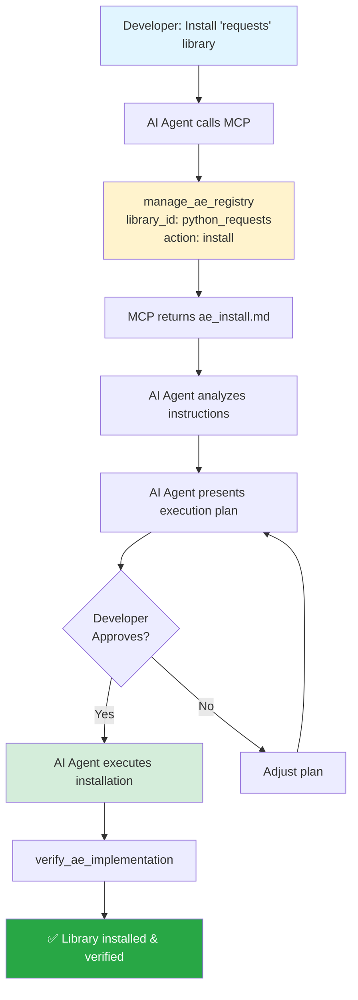
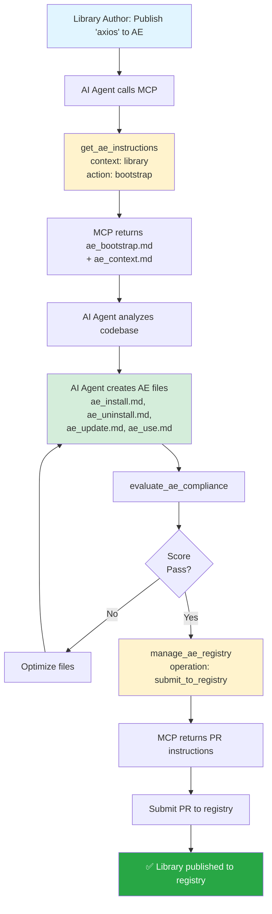

# Libraries as Agentic Executables

Can you imagine you can install / configure and uninstall libraries (in any language and framework) as easy as any app or game on your phone or computer?

This article is about how we can achieve this.

Or in other words - how to make libraries executable by AI agents in Agentic World. (using AI - LLM powered agents)

This problem follows three part structure:

1. [Why (The Problem)](#why-the-problem)
2. [How (The Solution)](#how-the-solution)
3. [Implementation Architecture](#implementation-architecture)
4. [How to use it Today?](#how-to-use-it-today)
5. [Conclusion](#conclusion)
6. [Links](#links)

If you want to jump to the implementation architecture, click [here](#implementation-architecture).
If you want to use it Today? click [here](#how-to-use-it-today).

Let's start with the Why (The Problem) part.

# Why (The Problem)

In the current time and year of writing this article, for any development project (i.e. coded project), we usually use libraries or packages to reuse code effectively.

Some of the libraries, usually configurable ones, often have extensive documentation and examples not only how to install, but how to configure, use, test and uninstall it.

The common installation, configuration and usage pattern may look like this:

1. use CLI or package manager to install/find the library
2. read the documentation of what we need to do to use it.
3. analyze your codebase to see how we can integrate it.
4. try to apply the actual code from the library to your codebase and your solution (from codebase structure/architecture point of view)
5. configure the library if needed.
6. try to test (visually or using tests) to see if it works.
7. modify the code if corrections are needed.
8. add tests or configuration if needed.

The more important - all instructions / documentation is written for humans.

And usually, most of these steps, we try to follow as humans - step by step.

However, with the rise of AI Agents - what if we will treat libraries and packages not as abstract reusable parts of code, but as the executable programs? Programs with the same ability to be installed, configured, used and uninstalled as usual apps or games on phone?

If you imagined it - let's call it "Agentic Executables" (below - "AE") and dive into the how we can create / maintain them:)

# How (The Solution)

As first thing, let's establish meta rules to create and modify files of AE:

1. AE Domain Knowledge - terms, concept, principles of what is AE to give enough context for AI Agent. This file will help us to maintain the files.
2. Installation creation with three logical steps:

- 1. Installation (using CLI or package manager)
- 2. Configuration
- 3. Integration

3. Usage creation.
4. Uninstallation creation.

With all of that, let's define the principles of working with AE.

# Working principles:

## Core Principles

- **Agent Empowerment** - AE docs written for AI, not humans. Therefore AI agents can work autonomously without or under minimal human intervention
- **Modularity** - Clear, reusable instruction steps and pieces.
- **Contextual Awareness** - Sufficient domain knowledge tailored made for AI Agent and ready to be used with end project.
- **Reversibility** - Clean uninstallation restores original state
- **Validation** - Built-in verification steps
- **Language / Framework Agnostic** - Works across all ecosystems and languages

## Core Idea

The core idea is to pass meta rules to AI Agent to give him ability to:

1. maintain the library executables (basically - meta instructions)
   1.1 The basic terms & domain knowledge (what is AE and how it works) - `ae_context.md`
   GOAL: To maintain `ae_bootstrap` and `ae_usage` files
   USER: Maintainer of the library
   1.2 The drop file to maintain the library executables - `ae_bootstrap.md`.
   GOAL: To create ae files structure and maintain it.
   USER: Maintainer of the library
   1.3 The drop file to use ae files in library - `ae_usage.md`
   GOAL: To use ae files of this library.
   USER: User (in other words - developer who uses this library)
2. ability to install / uninstall / update (basically, one time to use rules)
   2.1 Installation, Configuration, Integration files - `ae_install.md`
   GOAL: To install, configure and integrate the library.
   USER: User
   2.2 Uninstallation file - `ae_uninstall.md`
   GOAL: To uninstall the library.
   USER: User
   2.3 Update file - `ae_update.md`
   GOAL: To update the library from old version to new one.
   USER: User
3. ability to use the library frequently / or depending of its usage needs. Created via `ae_use.md` file.
   3.1 Usage file - the rule, adapted to the library name. For example, for library name `go_router` and Cursor AI usage it can be a rule in the path `go_router_usage.mdc`. During installation to User Codebase , AI Agent needs to ask User what AI Agent should be used, and place / name it according to it. For example, if User wants to use Cursor AI, AI Agent should place this rule to the path `.cursor/rules/go_router_usage.mdc`.
   GOAL: To use the library frequently / or depending of its usage needs.
   USER: User

The AE files structure:

```
root/
├── ae/
│   ├── ae_context.md
│   ├── ae_bootstrap.md
│   ├── ae_use.md
```

The library AE files will be located in the `root/ai_use` folder.
At the end this would be the structure of the library AE files:

```
root/
├── ai_use/
│   ├── ae_install.md
│   ├── ae_uninstall.md
│   ├── ae_update.md
│   ├── {library_name}_use.md
```

# Implementation Architecture

To implement this solution, I've created a registry of AE files to centralize them and make them easily accessible for developers.

Here is how it works in high level:

## Workflow Overview

```
Library Author                  Registry                   Developer
      │                            │                           │
      ├─► Create AE files          │                           │
      ├─► Submit to registry ─────►│                           │
      │                            │◄───── Fetch AE files ─────┤
      │                            │                           │
      │                            │                   AI Agent executes
      │                            │                   installation
```

To make it easy to use, I've designed an MCP server for giving AI tools to access and support AE ecosystem for developers and library authors.

Let's start with end developers example: how they can use AE files.

With MCP server, the workflow is pretty straightforward:

### Installation workflow example:



The same workflow works for other actions like usage, uninstallation, update.

As you can see, every action is executed by AI Agent, and with MCP server, it is easy to implement and maintain.

### Library Author workflow:

Almost the same workflow works for library authors - they can just ask AI Agent to bootstrap or update AE files, and AI Agent will do the rest.

One exception is that to submit AE Files to the Registry, we still need to send PR to the Registry repository.

(I think we can automate it in the future).



That's it:)

In the time of writing this article, the registry I've started testing registry and MCP server on personal projects and with some bugs (of course) install / uninstall / configure already works.

# How to use it Today?

## You are Developer:

1. First you need to install MCP server.
   To do this, please drop https://github.com/fluent-meaning-symbiotic/agentic_executables/blob/main/agentic_executables_mcp/ae_install.md file to your AI Agent or install it manually.
2.

- to install library (make sure it is in registry) write to your AI Agent: `create a plan to instal "library_name" as ae`
- to uninstall - `create a plan to uninstall "library_name" as ae`
- to update - `create a plan to update "library_name" as ae`
- to use - `create rules for {AI Agent} to use "library_name" as ae`

That's it:)

## You are Library Author | Maintainer:

- to bootstrap / update - `create a plan to bootstrap / update "library_name" as ae`
- to submit to registry - `create a plan to submit "library_name" to registry as ae`

That's it:)

# Conclusion

Please share your thoughts in the comments (that will be great support and motivation for me)! :-)
If you want to discuss / use it / have ideas to improve it - create issue or pull request to the repository: https://github.com/fluent-meaning-symbiotic/agentic_executables or jump in to discord server: https://discord.gg/y54DpJwmAn

Thank you for your time and have a great day!

Anton

# Links:

- Repository: https://github.com/fluent-meaning-symbiotic/agentic_executables
- Registry: https://github.com/fluent-meaning-symbiotic/agentic_executables/tree/main/ae_use_registry
- MCP Server: https://github.com/fluent-meaning-symbiotic/agentic_executables/tree/main/agentic_executables_mcp
- Discord Server: https://discord.gg/y54DpJwmAn
