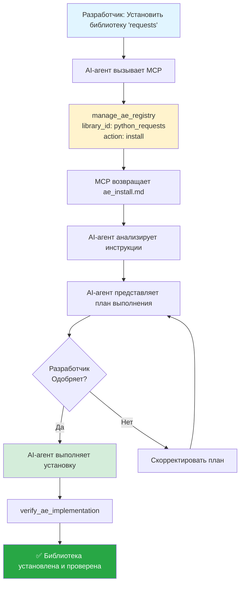
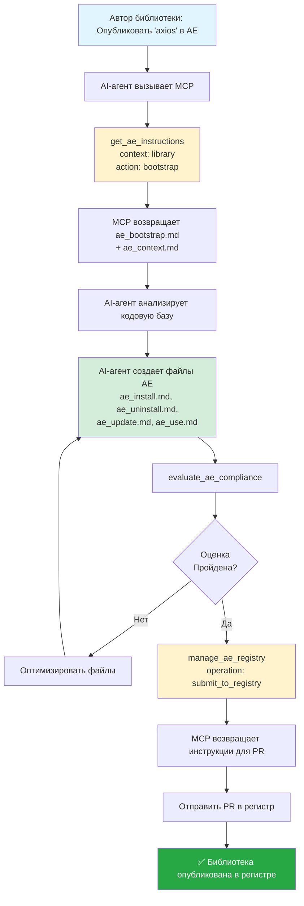

# Библиотеки как Agentic Executables

Представьте, что библиотеки можно устанавливать / настраивать и удалять (на любом языке и в любом фреймворке) так же легко, как любое приложение или игру на телефоне или компьютере?

Эта статья о том, как мы можем это сделать.

Или другими словами, framework Agentic Executables (далее - "AE") рассматривают библиотеки как исполняемые программы со структурированными, понятными для AI агента инструкциями. Вместо того чтобы полагаться на документацию написанную для людей, AI-агенты следуют стандартизированным `.md` файлам для автономной установки, настройки, интеграции, обновления и удаления библиотек.

Я решил разделить статью на несколько частей:

1. [Почему (Проблема)](#почему-проблема)
2. [Как (Решение)](#как-решение)
3. [Архитектура имплементации](#архитектура-имплементации)
4. [Как использовать это сегодня?](#как-использовать-это-сегодня)
5. [Заключение](#заключение)
6. [Ссылки](#ссылки)

Если вы хотите перейти к архитектуре реализации, нажмите [здесь](#архитектура-реализации).
Если вы хотите использовать это сегодня, нажмите [здесь](#как-использовать-это-сегодня).

Начнем с части "Почему (Проблема)".

# Почему (Проблема)

В настоящее время, на момент написания этой статьи, для любого проекта разработки (т.е. программного проекта) мы обычно используем библиотеки или пакеты для эффективного повторного использования кода.

Некоторые библиотеки, особенно настраиваемые, часто имеют большую документацию и примеры не только по установке, но и по настройке, использованию, тестированию и удалению.

Обычный флоу установки, настройки и использования может выглядеть так:

1. мы используем CLI или менеджер пакетов для установки/поиска библиотеки
2. читаем документацию, чтобы понять, что нужно сделать для ее использования.
3. анализируем свою кодовую базу, чтобы понять, как ее можно интегрировать.
4. пытаемся применить код из библиотеки к нашей кодовой базе и нашему решению (с точки зрения структуры/архитектуры кодовой базы)
5. при необходимости настраиваем библиотеку (ключи, конфигурации, etc)
6. пытаемся протестировать (визуально или с помощью тестов), чтобы убедиться, что все работает.
7. вносим исправления в код.
8. добавляем тесты или конфигурацию при необходимости.

Что еще более важно - все инструкции / документация изначально написаны для людей.

И обычно большинство этих шагов мы, как люди, стараемся выполнять шаг за шагом.

Однако, с развитием AI-агентов - что, если мы будем рассматривать библиотеки и пакеты не как абстрактные повторно используемые части кода, а как исполняемые программы? Программы с такой же способностью устанавливаться, настраиваться, использоваться и удаляться, как обычные приложения или игры на телефоне?

Если вы это представили - давайте назовем это "Agentic Executables" (далее - "AE") и погрузимся в то, как мы можем их создавать / поддерживать :)

# Как (Решение)

Прежде всего, давайте установим мета-правила для создания и изменения файлов AE:

1. AE Domain Knowledge - термины, концепции, принципы того, что такое AE, чтобы дать достаточно контекста для AI-агента. Этот файл поможет нам поддерживать файлы.
2. Создание установки с тремя логическими шагами:

- 1. Установка (с использованием CLI или менеджера пакетов)
- 2. Настройка
- 3. Интеграция

3. Создание использования.
4. Создание удаления.

Учитывая все это, давайте определим принципы работы с AE.

# Принципы работы:

## Основные принципы

- **Agentic First** - Документация AE написана для AI, а не для людей. Поэтому AI-агенты могут работать автономно без или с минимальным вмешательством человека.
- **Modularity** - Четкие, многократно используемые шаги и примеры.
- **Domain Knowledge** - Собираение и настройка промптов конкретно для библиотеки, специально разработанные для AI-агента и готовые к использованию в конечном проекте.
- **Reversibility** - Способность удаления библиотеки.
- **Validation** - Или как проверить что все работает как запланировано.
- **Language / Framework Agnostic** - Работает во всех frameworks и языках.

## Основная идея

Основная идея заключается в передаче мета-правил AI-агенту, чтобы дать ему возможность:

1. поддерживать исполняемые файлы библиотеки (в основном - мета-инструкции)
   1.1 Основные термины и Domain Knowledge (что такое AE и как он работает) - `ae_context.md`
   ЦЕЛЬ: Поддерживать файлы `ae_bootstrap` и `ae_usage`
   ПОЛЬЗОВАТЕЛЬ: Автор библиотеки или контрибьютор
   1.2 Файл для поддержки исполняемых файлов библиотеки - `ae_bootstrap.md`.
   ЦЕЛЬ: Создать структуру файлов AE и поддерживать ее.
   ПОЛЬЗОВАТЕЛЬ: Автор библиотеки или контрибьютор
   1.3 Файл для использования файлов AE в библиотеке - `ae_usage.md`
   ЦЕЛЬ: Использовать файлы AE этой библиотеки.
   ПОЛЬЗОВАТЕЛЬ: Конечный пользователь (другими словами - разработчик, использующий эту библиотеку)
2. возможность устанавливать / удалять / обновлять (в основном, одноразовые правила использования) создаются с помощью файла `ae_bootstrap.md`.
   2.1 Файлы установки, настройки, интеграции - `ae_install.md`
   ЦЕЛЬ: Установить, настроить и интегрировать библиотеку.
   ПОЛЬЗОВАТЕЛЬ: Конечный пользователь
   2.2 Файл удаления - `ae_uninstall.md`
   ЦЕЛЬ: Удалить библиотеку.
   ПОЛЬЗОВАТЕЛЬ: Конечный пользователь
   2.3 Файл обновления - `ae_update.md`
   ЦЕЛЬ: Обновить библиотеку со старой версии на новую.
   ПОЛЬЗОВАТЕЛЬ: Конечный пользователь
3. возможность частого использования библиотеки / или в зависимости от необходимости. Создается с помощью файла `ae_use.md`.
   3.1 Файл использования - правило, адаптированное к названию библиотеки. Например, для библиотеки с названием `go_router` и использования Cursor AI это может быть правило в пути `go_router_usage.mdc`. Во время установки в кодовую базу пользователя AI-агент должен спросить пользователя, какой AI-агент следует использовать, и разместить / назвать его соответствующим образом. Например, если пользователь хочет использовать Cursor AI, AI-агент должен разместить это правило по пути `.cursor/rules/go_router_usage.mdc`.
   ЦЕЛЬ: Частое использование библиотеки / или в зависимости от необходимости.
   ПОЛЬЗОВАТЕЛЬ: Конечный пользователь

Структура файлов AE:

```
root/
├── ae/
│   ├── ae_context.md
│   ├── ae_bootstrap.md
│   ├── ae_use.md
```

Файлы AE библиотеки будут находиться в папке `root/ai_use`.
В итоге структура файлов AE библиотеки будет следующей:

```
root/
├── ai_use/
│   ├── ae_install.md
│   ├── ae_uninstall.md
│   ├── ae_update.md
│   ├── ae_use.md
```

# Архитектура имплементации

Для имплементации этого решения я создал реестр (registry) файлов AE, чтобы централизовать их и сделать легкодоступными для разработчиков.

Вот как это работает на высоком уровне:

## Workflow Overview

```
Автор библиотеки             Registry                     Разработчик
      │                            │                           │
      ├─► Создать файлы AE         │                           │
      ├─► Отправить в Registry ─────►│                           │
      │                            │◄─── Получить файлы AE ────┤
      │                            │                           │
      │                            │             AI-агент выполняет
      │                            │                   установку
```

Чтобы упростить использование, я разработал MCP-сервер, который дает возможность AI-агентам получать инструкции и поддерживать экосистему AE как для разработчиков, так и для авторов библиотек.

Начнем с примера для конечных разработчиков: как они могут использовать файлы AE.

С MCP-сервером рабочий процесс довольно прост:

### Пример рабочего процесса установки:



Тот же рабочий процесс применяется и для других действий, таких как использование, удаление, обновление.

Как видите, каждое действие выполняется AI-агентом, и с MCP-сервером его легко реализовать и поддерживать.

### Рабочий процесс автора библиотеки:

Почти такой же рабочий процесс работает и для авторов библиотек - они могут просто попросить AI-агента создать или обновить файлы AE, и AI-агент сделает все остальное.

Единственное исключение - для отправки файлов AE в реестр нам все еще нужно отправить PR в репозиторий регистра.

(думаю, это можно автоматизировать в будущем).



Вот и все :)

На момент написания этой статьи я начал тестировать регистр и MCP-сервер на личных проектах, и, несмотря на некоторые ошибки (конечно), установка / удаление / настройка уже работают.

# Как использовать это сегодня?

## Вы разработчик:

1. Сначала нужно установить MCP-сервер.
   Для этого, пожалуйста, перетащите файл https://github.com/fluent-meaning-symbiotic/agentic_executables/blob/main/agentic_executables_mcp/ae_install.md в своего AI-агента или установите его вручную.

2. Затем используйте:

- для установки библиотеки (убедитесь, что она есть в регистре), напишите своему AI-агенту: `create a plan to install "название_библиотеки" as ae`
- для удаления - `create a plan to uninstall "название_библиотеки" as ae`
- для обновления - `create a plan to update "название_библиотеки" as ae`
- для использования - `create rules for {AI-агента} to use "название_библиотеки" as ae`

Вот и все :)

## Вы автор | контрибьютор библиотеки:

- для создания / обновления - `create a plan to bootstrap / update "название_библиотеки" as ae`
- для отправки в регистр - `create a plan to submit "название_библиотеки" to registry as ae`

Вот и все :)

# Заключение

Пожалуйста, поделитесь своими мыслями в комментариях (это будет для меня большой поддержкой и мотивацией)! :-)

Спасибо за ваше время и хорошего дня!

Антон

# Ссылки:

- Репозиторий: https://github.com/fluent-meaning-symbiotic/agentic_executables
- Registry: https://github.com/fluent-meaning-symbiotic/agentic_executables/tree/main/ae_use_registry
- MCP-сервер: https://github.com/fluent-meaning-symbiotic/agentic_executables/tree/main/agentic_executables_mcp
