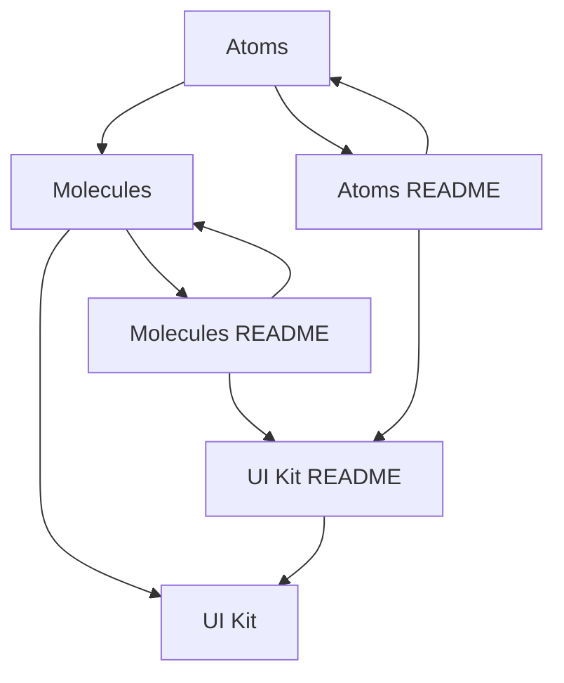
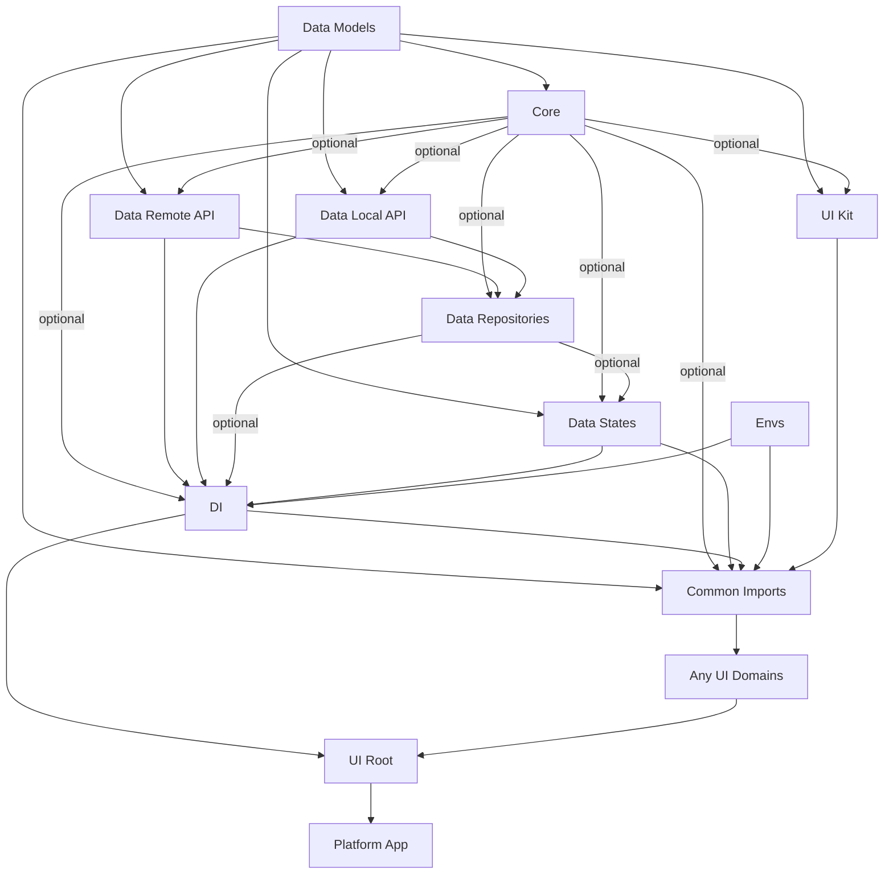
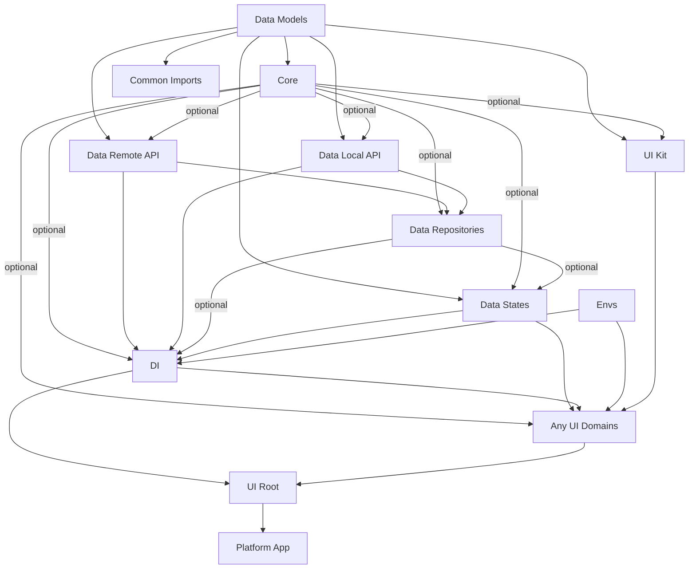
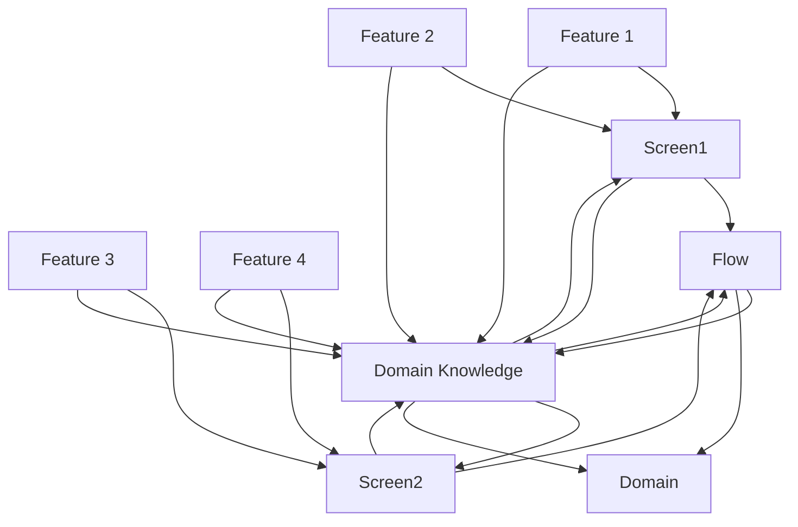

#article Flutter app ai centric architecture for small startups

Short description:Thoughts about scalable app architecture via code structure, developer as a user philosophy; suitable for indie developers and early stages startups.

v1 As series.
In a series of articles, I would like to share my thoughts about how to structure codebase and use different approaches for architecture structure scaling through different stages of product growth.

v2 As single article.
In this article, I would like to share my thoughts about how to structure and use different approaches through different stages of product growth.

Note: All my thoughts are based on my own experience from having made some decisions and over time watching some of those decisions prevail or fail. It is my reflection of what is possible to do and how, not strict guidelines to follow, but rather instead - to inspire and adapt.

It may or may not complement in some cases general development approaches, especially in large companies or recently published https://docs.flutter.dev/app-architecture amazing guide. Instead, I will focus only on startup early stages, for those who take a journey starting from a single Flutter developer and look for a way ahead to scale it up to several (let’s take a five-six) developers in the company when needed.

Second Note: Product development and ordered product in-studio paths can be completely different, so my advice is to skip stages if needed, aligning with your personal experience.

Third Note: during texts, I will treat developer as a user - imagine project code structure via folders and file structures first - in the same way most developers look at their code. For me, it was a great discovery that it is the most convenient way to hand your work over for maintenance or feature changes. Part of that discovery was watching a video of Clean Architecture and Design https://youtu.be/Nsjsiz2A9mg?si=LDSqhU_6DlyyVL1K&t=527 , other parts include Domain Drive Development or DDD https://en.wikipedia.org/wiki/Domain-driven_design, Test Drive Development or TDD, and just a development routine, and I hope to continue this journey along the way:)

Simply put, you define the code structure, which declares how your code will communicate, and then apply your preferred architecture patterns to it.

Fourth Note:
As of January 27, 2025, it is evident that many developers utilize AI tools to explain code or quickly prototype solutions. Therefore, when the term 'prompt' is mentioned, it refers to a saved question or response generated by an AI tool in text format.

Fifth Note:
Before development or at any stage.
Create your own AI preferences / agent-rules for your favorite AI tool and project-wide preferences, so other developers can use it in the future. For example, if you use Cursor, you can find useful rules - https://cursor.directory .
Keep in mind that it should always be part of your architecture— you will iterate over these rules, roll back, write, rewrite, test it, etc. So, treat it just as a part of your codebase.

In the same time, since this is quite a new approach, it’s a quite experimental technique to use it and may produce unpredictable results. Be careful and always rely on your skills.

Sixth Note: Terminology.
Let's define the meanings of several key terms (while there are many, we need to focus on these to ensure a clear context for the notes):

End user - a user, who uses the application on any platform available - iOS, Android, macOS, Windows, Linux, web, etc.

Domain - logically defined and restricted by its subject area (scope) in your application, defined by end user experience combined with application functionality.

https://en.wikipedia.org/wiki/Domain_(software_engineering)

Complex App Example:
Imagine a financial app and you are the end user.
You may expect the following logical domains:-(Intro) Guide how to use the application, or quiz, or news - some screens that may appear before Home appears.
-(Home) Specific to home functionality, most frequent features that the user uses. This domain may or may not use features from other domains. As the user expects it to be fast to use, let’s call it fast functions experience.
-(Payments) - you may expect that the main screen will lead to other screens, such as bank providers, digital transfers etc.. but all these screens will be logically tied to a single subject (scope) of payment experience.
-(Profile) The end user can expect that he can sign in/ sign out, can delete his account, go to privacy settings, check some documents. Let’s call it profile experience.
-(Support) That domain may have a screen with chat, it may have different conversations in different screens, but at the same time all of them will define a subject of support experience.

To develop each domain, you will have to capture how end users or experts, specialists experience it or experience it by themselves.
Or in other words - you will have to define and research domain knowledge.

Domain knowledge - “is knowledge of a specific discipline”, captured from domain experts/specialists by analytics, designers or through iterative design, your own experience or work. In our case it would be the experience of the end user who uses your app.
https://en.wikipedia.org/wiki/Domain_knowledge

Flow - a one screen or series of screens, pages or views orginized in certain direction from user perspective. For example -  Auth Flow.

Screen - a widget, partially or fully covering a screen, consists of features placed on that screen / page / view. Personally, I like the concept to treat any screen as a page as a view, which can be seen fullscreen or take part of the layout which is buildable with nested navigation (https://pub.dev/documentation/go_router/latest/go_router/ShellRoute-class.html) and similar to how JS frameworks work in the web (https://router.vuejs.org/guide/essentials/nested-routes).

Feature - “distinguishing characteristic of a software item (e.g., performance, portability, or functionality)”. Applying to the domain, let’s define it as a single-purpose particular capability/functionality, which in combination with other features helps the end user to experience the domain as a whole.
https://en.wikipedia.org/wiki/Software_feature

Stage 1 - Prototyping.
Team: 1 (or at best 2) Developers
Main focus: develop fast and throw away every piece you don’t like as a ClientUser (or call it business).
Treat your repo as a workbench - you don’t know what will work, so expect multiple projects at the same time, even in different frameworks, different languages.

I suggest the following folder structure in that stage.

Abstract code structure

```
/
├── prototypes
│   ├── {prototype_name}
│   │   ├── idea.md  // This file contains the initial ideas and AI-generated insights for the prototype.
├── prompts
│   ├── agents
│   │   ├── {name}_agent.md  // Rules and guidelines for AI agents used in the project.
│   ├── ideas
│   │   ├── {idea}_gen.md  // Only AI-generated answers - ideas and prompts.
│   │   ├── {idea}.md  // Handwritten notes and domain knowledge. May include AI-generated answers too.
```

Example code structure

```
/
├── prototypes
│   ├── flutter/todo_with_amazing_animation
│   │   ├── idea.md
│   ├── typescript/yjs_prototype
│   │   ├── idea.md
│   ├── dart/frog_server
│   │   ├── idea.md
│   ├── just_cool_feature
│   │   ├── idea.md
├── prompts
│   ├── agents
│   │   ├── flutter_agent.md
│   │   ├── flutter_architector_agent.md
│   │   ├── rust_agent.md
│   ├── ideas
│   │   ├── charmed_animated_scroll_gen.md
│   │   ├── that_gradient_shader.md
```

If you don’t like the word prototype, use playground or experiments - this word is important because in later stages you will want to make sure that these pieces are playable, even for newcomers, but not movable, so your git commit will not explode xD

Every prototype should be as small as possible - it can be one to three files just to test and experience your idea.
I would advise not to set up strict lints for this stage to keep code as simple and small as possible, but in case you are testing them or using a new language - certainly go for it.

Stage 2 - Main idea or MVP (Minimum Viable Product). Domain iterations.
Team: 1-2 Developers
Main focus: set up such an architecture that will support and help fast iterations in domains and do so.

The stage when you have at least one idea, and you are about to start development of the MVP.
And you iterate over and over domains to find the best (at this particular moment) experience for end users.

A note about linter rules
Strangely, just a couple of linter rules - and your path to create or eliminate your technical debt is set.

Choose your linter rules even before you look into the code, and choose wisely. These rules will affect not only you, but your AI-generated code, code quality, and technical debt as eventually, your codebase will grow, and if you decide to change just one rule, you may trigger a huge amount of linter warnings, errors, and team discussions.

UI Kit
This stage highly depends on the question - are you a completely lone developer, or a team with a designer, because the first thing to do is to create some, maybe not perfect, but usable ui_kit.
To make this, try to look into different techniques for organizing it. Personally, I prefer to use at least two steps from the Atomic Design methodology https://atomicdesign.bradfrost.com/chapter-2/: atoms and molecules, but in my opinion, it highly depends on what you expect to achieve with the design, for what platforms the product is developing, etc. For one product, it can have only atoms and molecules. Another one - specific repeatable patterns for complex product cards, layout templates, pages templates, for another - Material, Human Guidelines, FluentUI approach (usually in that case, it is quite convenient to find official design in Figma or Sketch, etc.).
Treat it as a completely standalone library to not tie to any business requirements and focus on how it would be convenient to use, to develop, and maintain not only by you but by other developers and AI too.

Hopefully, to get it into the right words - that doesn’t mean it should be perfect, rather it should have well-documented READMEs around to explain the principles of how to create a new component of this library and make it useful.
From my experience, it is critically important how well you organize and define taxonomy, documentation, and convenience - this will affect any developer’s decision in the future, how fast you will be able to iterate (develop new, maintain, fix, and change old) for features, screens, etc.

UI Kit relations & workflow example



Then create the basic app code structure:

```
/
├── core // everything that is not API, data, state, and ui. May contain isolated business logic, but not tied to any specific domain.
│   ├── utils  // Utility functions, some duplicate isolated logic that is more related to the framework than the app, such as serialization, etc.
│   ├── extensions  // Extensions for types.
│   ├── hooks  // Optional hooks for logic duplication reduction. Usually handy for small portions of logic that are used in build methods.
│   ├── l10n  // Optional localization files.
│   ├── side_services  // Optional third-party services like Firebase, Analytics, etc.
├── data_local_api  // I use word API, as it is just shorter:) but it has the same meaning as services, sources). Prefer to treat it as your local backend server.
├── data_remote_api  // (services, sources) Remote APIs, preferably generated from backend schemas (REST or GraphQL or any other).
├── data_repositories  // (optional) Handles both local and remote APIs.
├── data_models
│   ├── api_dto  // (optional) Data Transfer Objects for APIs. Preferably generated for remote APIs, can be useful for local APIs too.
│   ├── {domain}_models  // (optional) Domain-specific models.
├── data_states  // Global level states for runtime data (notifiers, controllers, blocs, commands, etc.). Its purpose mostly to keep runtime data prepared to use in UI. These states can be used in all domains.
├── di  // Dependency injection setup (it may be provider, get_it, inherited_models, etc.). Will be available for all domains in the app. Here you can set up API, states + methods to initialize them and use in `ui_root`.
├── ui_root  // Place here everything that is needed for the app to start: bootstrap methods, data_state and side_services initialization, error catching (Firebase, Sentry), Analytics, etc.
├── ui_kit // uses below two Atomic Design principles: atoms and molecules, but you can use any other principles, such as Material, Human Guidelines, FluentUI, etc.
│   ├── UI_KIT_README.md  // Short Rules and main principles defining how and why you made certain choices in underlying structure and links to the underlying READMEs. The last part is important, because as I found out, AI tools like to use README for designing or development.
│   ├── atoms
│   │   ├── ATOM_README.md  // Domain knowledge for atoms.
│   ├── molecules
│   │   ├── MOLECULE_README.md  // Domain knowledge for molecules.
├── ui_{domain} // all ui domains
│   ├── {DOMAIN}_KNOWLEDGE.md  // Domain knowledge for the specific UI domain.
│   ├── {flow} // one or more screens or views united into one flow. Every flow has one entry point screen (or at least one) and every screen has one or more features.
│   │   ├── {flow}_screen.dart  // Entry point for the flow.
│   │   ├── {feature_name}  // Domain and flow-specific features.
├── envs.dart  // [Environment variables](https://codewithandrea.com/tips/dart-define-from-file-env-json/)
├── router.dart  // Your preferred router setup with defined routes
├── {platform}_app.dart  // Entry point for the platform-specific app.
├── common_imports.dart  // Optional. Place here all imports that are used in the whole app. Also, it is handy to place here all exports from barrel files from each top folder.
```

And finally, create domains `ui_{domains}` which will include the most critical app experience and iterate over them.

A note about UI Domains
Schematic example of what can be shared, and what - can't in domain.Inside domain, you may work with different types of data layer, screen states, widget states (in Flutter it is called Ephemeral state https://docs.flutter.dev/data-and-backend/state-mgmt/ephemeral-vs-app#ephemeral-state), some business logic, specific to feature models which you never intend to share with other domains.
I suggest a small decision to manage relations between domains - reuse only widgets (flows, screens, features), do not share/reuse data. If you need to share something from domain local data layer - move it to global data layer, from which it will be available for all domains. For example, a local model may go to data_models, screen state maybe refactored and go to data_states.

A word about data_state - Flutter documentation calls it App State https://docs.flutter.dev/data-and-backend/state-mgmt/ephemeral-vs-app#app-state. In other words, you can define it as global-level states for runtime data (notifiers, controllers, blocs, commands, etc.). Its purpose is mostly to keep runtime data prepared to use in UI. These states can be used in all domains.

Now let's move back to global project structure.

Relations between global layers
Option 1 - with common_imports



Option 2 - without common_imports



Note. Barrel file.
I find it very convenient to create barrel files on each top folder by exporting underlying classes in the same manner as Dart does for package export https://dart.dev/tools/pub/create-packages. This makes future refactoring easier and gives the ability to not mess with git changes when some file moves later.
Also, this practice makes it easier to think of all global folders as packages / libraries which are independent and may change their content, internal structure, but will maintain consistency with their external API.
At the same time, currently I have no experience in how it affects the ability of deferred imports. https://dart.dev/language/libraries#lazily-loading-a-library I think at least you may expect that it will have no effect on this stage, but since it is a way to load libraries - it may become more effective with stage 4.

Second note. Domain Knowledge.

UI Domain relations & workflow example



Optionally, I recommend trying to place in all data and ui layer folders a Domain Knowledge file. It should be simple enough to regenerate and iterate with AI - this may give you context to work with particular domain features, develop, or maintain.

Semantically, to make it easy to get this context and navigate, it would be great if you align it with the above folder’s name, for example,
If the folder above is ui_guide, then below you may place a file UI_GUIDE_CONTEXT.md or UI_GUIDE_KNOWLEDGE.md. The reason is simple: when you use file search - you will be able to quickly find this file, when you communicate with AI tool - you will much faster find required context.

Now let’s take a note on semantics.
First, the whole data layer has a prefix data for two reasons:

- to keep it at the top of the lib folder, so we could easily access it
- to keep always in mind that it is a data layer only

Second, domains (or UI layer) have a prefix ui. This makes this layer

- on visual and physical distance from the data layer
- stack all ui related domains together.

While it may seem an overengineering attempt, defining the organization of data and ui layers visually distinctive from each other will affect how you develop your application because you will see it differently - more from an end-user perspective.

Finally, let's summarize all words into graphics:

Abstract code structure

```
/
├── pubspec.yaml  // <- define workspace to use the whole space as monorepo https://dart.dev/tools/pub/workspaces
├── apps/
│   └── {platform}_app/  // <- platform can be replaced by your first target platform, for example mobile_app
│       ├── core/
│       │   ├── core.dart
│       │   ├── utils/
│       │   ├── extensions/
│       │   ├── hooks/
│       │   ├── l10n/
│       │   └── services/
│       ├── data_local_api/
│       ├── data_remote_api/
│       ├── data_repositories/
│       ├── data_models/
│       │   ├── api_dto/
│       │   └── {domain}_models/
│       ├── data_states/
│       ├── di/
│       ├── ui_root/
│       ├── ui_kit/
│       │   ├── ui_kit.dart  // <- place ui kit initially as a folder of mobile_app to keep initial simplicity
│       │   ├── UI_KIT_README.md
│       │   ├── atoms/
│       │   │   └── ATOM_README.md
│       │   └── molecules/
│       │       └── MOLECULES_README.md
│       ├── ui_{domain}/
│       │   ├── {DOMAIN}_KNOWLEDGE.md
│       │   ├── {flow}/
│       │   │   └── {feature_name}/
│       ├── envs.dart
│       ├── router.dart
│       ├── common_imports.dart
│       └── {platform}_app.dart
└── prototypes/
    └── {prototype_name}/
        └── idea.md  // This file contains the initial ideas and AI-generated insights for the prototype.
    └── prompts/
        ├── agents/
        │   └── {name}_agent.md
        └── ideas/
            ├── {idea}_gen.md
            └── {idea}.md
```

Example code structure:

```
/
├── pubspec.yaml
├── apps/
│   └── mobile_app/
│       ├── core/
│       │   ├── core.dart
│       │   ├── utils/
│       │   ├── extensions/
│       │   ├── hooks/
│       │   ├── l10n/
│       │   └── services/
│       ├── data_local_api/
│       ├── data_remote_api/
│       ├── data_repositories/
│       ├── data_models/
│       │   ├── data_models.dart
│       │   ├── api_dto/
│       │   ├── payments_models/
│       │   ├── chat_models/
│       │   └── profile_models/
│       ├── data_states/
│       │   ├── data_states.dart
│       │   ├── app_settings_notifier.dart
│       │   └── user_profile_cubit.dart
│       ├── di/
│       │   ├── di.dart
│       │   ├── dependency_injector.dart
│       │   ├── global_initializer.dart
│       │   ├── global_state_initializer.dart
│       │   └── global_state_providers.dart
│       ├── ui_root/
│       │   ├── ui_root.dart
│       │   ├── app_scaffold.dart
│       │   └── bootstrap.dart
│       ├── ui_kit/
│       │   ├── ui_kit.dart
│       │   ├── UI_KIT_README.md
│       │   ├── atoms/
│       │   │   ├── atoms.dart
│       │   │   ├── ATOM_README.md
│       │   │   ├── ui_text_field.dart
│       │   │   ├── ui_icon.dart
│       │   │   └── ui_badge.dart
│       │   └── molecules/
│       │       ├── molecules.dart
│       │       ├── MOLECULES_README.md
│       │       ├── ui_search_field.dart
│       │       ├── ui_app_bar.dart
│       │       └── ui_animated_grid.dart
│       ├── ui_payments/
│       │   ├── ui_payments.dart
│       │   ├── PAYMENTS_KNOWLEDGE.md
│       │   ├── transactions_flow/
│       │   │   ├── transactions_screen.dart
│       │   │   ├── features/ // consider making this name adaptive; if a screen lacks features, it may not need them. If features are complex, naming them may be more efficient than grouping them.
│       │   │   │   ├── transactions_list.dart
│       │   │   │   └── edit_transaction_popup.dart
│       │   └── pay/
│       │       ├── pay_screen.dart
│       │       ├── qr_pay/
│       │       │   ├── *
│       │       │   └── qr_pay_feature.dart
│       │       ├── provider_pay/
│       │       │   ├── *
│       │       │   └── provider_pay.dart
│       │       └── crypto_provider_pay/
│       │           ├── *
│       │           └── crypto_provider_pay.dart
│       ├── ui_profile/
│       │   ├── ui_profile.dart
│       │   ├── PROFILE_KNOWLEDGE.md
│       │   ├── auth/
│       │   └── settings/
│       ├── envs.dart
│       ├── router.dart
│       └── mobile_app.dart
└── prototypes/
    ├── flutter/todo_with_amazing_animation/
    │   └── idea.md
    ├── typescript_yjs_prototype/
    │   └── idea.md
    ├── dart_frog_server/
    │   └── idea.md
    └── just_cool_feature/
        └── idea.md
/prompts/
├── agents/
│   ├── flutter_agent.md
│   ├── flutter_architector_agent.md
│   └── rust_agent.md
└── ideas/
    ├── charmed_animated_scroll_gen.md
    └── that_gradient_shader.md
```

Personally, I find it difficult to nest flows too deep, so there we have two choices:

- when the flow becomes too huge or feels logically complete - it seems more convenient to acknowledge it as a Domain and move it on a global level as a Domain.
- or break this flow into several flows, if it feels there is too much different functionality in one place.

I think the most important part of this stage is to accumulate enough Domain knowledge before diving too deep into endless features.

Stage 3 - Feature iterations.
Team: 2 Developers
Main focus: test and try features for specific domains to make these domains logically complete.

While this part is quite small for changes - and may not contain any radical changes in structure, I think it’s quite important on this stage to follow two principles:

- Keep refreshing, refining, and updating domain knowledge from testing and using the application.
- Keep every small feature implementation separate from the screen where it is placed. Treat the screen as a layout where you place widgets, and it would be much easier to reuse any feature-related widgets, as they will behave as self-contained micro applications.

Stage 4
Team: 2 - 3 Developers
In my opinion, there are two paths:

Path 1 - Scaling to other platforms.

This stage means that we need to publish it to stores on several platforms simultaneously.
In that case, we will have to deal not only with different form factors , but also (https://docs.flutter.dev/ui/adaptive-responsive/best-practices)

That means, it would be better to make the following changes to the structure.
First, move the whole data layer (folders with prefixes data) and core into a new package “core”.

```
/packages/
├── core/
│   ├── core.dart
│   ├── src/
│   │   ├── core/ // I prefer to keep core as a separate package, as it often has tendency to be reused in other projects, and this way it would be easier to separate it in future to a separate package.
│   │   │   ├── utils/
│   │   │   ├── extensions/
│   │   │   ├── hooks/
│   │   │   ├── l10n/
│   │   │   └── side_services/
│   │   ├── data_local_api/
│   │   ├── data_remote_api/
│   │   ├── data_repositories/
│   │   ├── data_models/
│   │   │   ├── api_dto/
│   │   │   └── {domain}_models/
│   │   ├── data_states/
│   │   ├── di/
```

Second, move the whole ui_kit into a separate package.

```
/packages/
├── ui_kit/
│   ├── ui_kit.dart
│   ├── UI_KIT_README.md
│   ├── atoms/
│   │   ├── ATOM_README.md
│   ├── molecules/
│   │   ├── MOLECULES_README.md
```

Third, take a look at domains and features and where they are placed.

What you can find is that if most of the features were separated from screens inside flows, it is quite easy to separate every screen to the following functionality:

1. View Layouts // <- layout where features were placed.
2. Flow logic // <- navigation between views
3. Features // <- business implementation

Then move all domain-related logic - layouts (optional), flow (optional), features to a new package “ui_domains”.
This will be your foundation where all features, sharable layouts, and flows for domains are written. So think of it like a box of blocks, which separately have some independent functionality within a scope of a specific domain.

Because every platform has its own layouts, flows can be different. For example, where in mobile you will push several screens, in desktop you may open just one window.

Then, depending on your end goal, create a separate app for every platform you need.
For example, you can end up with the following structure:

Abstract code structure

```
/
/apps/
├── {platform}_app/  // <- separate applications with new entry main, which can use different layouts, based on ui_domains package.
/packages/
│   ├── core/
│   ├── ui_kit/
│   ├── ui_domains/ // <- this new package will be used in all apps
│   │   ├── src/
│   │   │   ├── ui_{domain}/
│   │   │   │   ├── {DOMAIN}_KNOWLEDGE.md
│   │   │   │   ├── {flow}/
│   │   │   │   │   ├── {feature_name}/
│   │   │   │   │   ├── ├── {feature_name}.dart // barrel file with conditional exports, which are extremly useful for platform dependent features https://dart.dev/tools/pub/create-packages#conditionally-importing-and-exporting-library-files
│   │   │   │   │   ├── ├── {feature_name}_{platform}/
│   │   │   │   │   ├── layouts/ // <- typically you may have different layouts for same features, so it is make sense to place it directly in the flow folder. But in same time, if you need to move to different place - thats fine too - since in my opinion, that's more business/design related decision.
```

Example code structure:

```
/
/apps/
├── desktop_app/
├── web_app/
├── mobile_app/
/packages/
├── core/
├── ui_kit/
├── ui_domains/
│   ├── src/
│   │   ├── ui_payments/ // <- domain
│   │   │   ├── ui_payments.dart // <- barrel file with exports
│   │   │   ├── PAYMENTS_KNOWLEDGE.md // <- domain knowledge
│   │   │   ├── pay/ // <- flow
│   │   │   │   ├── qr_pay/ // <- feature
│   │   │   │   │   ├── qr_pay_feature.dart // <- feature barrel file with conditional imports
│   │   │   │   │   ├── qr_pay_ios/ // <- platform feature implementation
│   │   │   │   │   ├── qr_pay_android/
│   │   │   │   │   ├── qr_pay_web/
│   │   │   │   ├── provider_pay/ // <- feature
│   │   │   │   │   ├── provider_pay.dart // <- feature barrel file
│   │   │   │   │   layouts/ // <- flow layouts
│   │   │   │   │   ├── desktop/
│   │   │   │   │   ├── mobile/
│   │   │   ui_profile/ // <- domain
│   │   │   ├── ui_profile.dart // <- domain barrel file
│   │   │   ├── PROFILE_KNOWLEDGE.md // <- domain knowledge
│   │   │   ├── auth/ // <- flow, but as you can imagine, if it will outgrow just auth logical domain, the transform it into a domain and move up.
│   │   │   │   ├── login/ // <- feature
│   │   │   │   ├── ├── login_ios/
│   │   │   │   ├── ├── login_android/
│   │   │   │   ├── ├── login_web/
│   │   │   │   ├── registration/
│   │   │   │   ├── ├── registration_ios/
│   │   │   │   ├── ├── registration_android/
│   │   │   │   ├── ├── registration_web/
│   │   │   │   │   layouts/ // <- flow layouts
│   │   │   │   │   ├── desktop/
│   │   │   │   │   ├── mobile/
│   │   │   ├── settings/ // <- flow
│   │   │   │   ├── settings.dart // <- flow barrel file
│   │   │   │   ├── customization/ // <- feature
│   │   │   │   ├── ├── customization_ios/
│   │   │   │   ├── ├── customization_android/
│   │   │   │   ├── ├── customization_web/
```

The difference will depend on what features are represented. For example, some iOS native functionality may not just work or not exist on Linux desktop. Therefore, you can create a Linux implementation specific to a feature or construct an entirely different experience using only some of iOS features.

Path 2 - Same app - different configurations.

Another way to scale your application by having different flavors. https://docs.flutter.dev/deployment/flavors . But at the same time, if the differences are huge, it would be reasonable to reconstruct them as different apps.

So in contrast with Path 1, I think in this path you may have the same layouts, but new domains, new flows, and new specific to new apps features. The important part, that you may or may not include include domains, flows or features to different apps.

Abstract code structure:

```
/
/apps/{mobile_app_with_different_flows}/
/packages/
│   ├── core/
│   ├── ui_kit/
│   ├── ui_domains/
│   │   ├── src/
│   │   │   ├── ui_{domain}/
│   │   │   │   ├── {DOMAIN}_KNOWLEDGE.md
│   │   │   │   ├── {flow}/
│   │   │   │   │   ├── {feature_name}/
│   │   │   │   │   ├── {experimental_feature_name}/
│   │   │   │   ├── {experimental_flows}/
│   │   │   │   │   ├── {feature_name}/
│   │   │   ├── ui_{experimental_domain}/
│   │   │   │   ├── {DOMAIN}_KNOWLEDGE.md
│   │   │   │   ├── {flow}/
│   │   │   │   │   ├── {feature_name}/
│   │   │   │   │   ├── ├── {feature_name}_{platform}/
```

Example code structure:

```
/
/apps/
├── mobile_app_spring_edition // <- separate applications with new entry main, which can use different layouts, based on ui_domains package.
├── mobile_app_with_gamification/
├── mobile_app_with_ai/
/packages/
├── core/
├── ui_kit/
├── ui_domains/
│   ├── src/
│   │   ├── ui_payments/
│   │   │   ├── ui_payments.dart
│   │   │   ├── PAYMENTS_KNOWLEDGE.md
│   │   │   ├── pay/ // <- flow
│   │   │   │   ├── galactical_pay/ // <- experimental feature
│   │   │   ├── scan_and_pay/ // <- experimental flow
│   │   │   ui_ai_chatbot/ // <- experimental domain
│   │   │   ├── ui_ai_chatbot.dart
│   │   │   ├── AI_CHATBOT_KNOWLEDGE.md
│   │   │   ui_waiting_game/
│   │   │   ├── ui_waiting_game.dart
│   │   │   ├── WAITING_GAME_KNOWLEDGE.md
│   │   │   ui_picture_board/
│   │   │   ├── ui_picture_board.dart
│   │   │   ├── PICTURE_BOARD_KNOWLEDGE.md
```

Stage 5 - Scaling application domains.
Team: 3-6 Developers

Lastly, let’s talk about what you can do if a feature grows too big, and you have enough resources to maintain it independently.

Since from the start, you have separated the domains clearly, you have several options:

1. Extract the domain as a package
2. Extract specific flows as a package
3. Extract specific features as a package

Abstract code structure:

```
/packages/
├── core/
├── ui_kit/
├── ui_{domain}/
│   ├── {DOMAIN}\_KNOWLEDGE.md
│   ├── src/
│   │   ├── {flow}/
│   │   │   ├── {feature_name}/
│   │   │   │   ├── {feature_name}_{platform}/
│   │   │   ├── layouts/
│   │   │   │   ├── {layout_name}/
```

Example - moving ui_payments domain to packages:

```
/packages/
├── ui_payments/
│   ├── ui_payments.dart
│   ├── README.md
│   ├── PAYMENTS_KNOWLEDGE.md
│   ├── src/
│   │   ├── provider_pay/ // <- flow
│   │   │   ├── provider_pay.dart // <- feature
│   │   │   ├── ├── provider_pay_ios/ // <- platform feature implementation
│   │   │   ├── ├── provider_pay_android/
│   │   │   ├── ├── provider_pay_web/
│   │   │   │   layouts/
│   │   │   │   ├── desktop/
│   │   │   │   ├── mobile/
│   │   │   pay/ // <- flow
│   │   │   ├── qr_pay/ // <- feature
│   │   │   │   ├── qr_pay_feature.dart // <- feature
│   │   │   │   ├── ├── qr_pay_ios/ // <- platform feature implementation
│   │   │   │   ├── ├── qr_pay_android/
│   │   │   │   ├── ├── qr_pay_web/
│   │   │   │   layouts/
│   │   │   │   ├── desktop/
│   │   │   │   ├── mobile/
```

In any case, since on the previous stage you already have an independent data layer as a package + an independent ui kit, your task is quite simple - treat all and plug them as APIs, and use them the same you use Flutter widgets or any pub package.

This way, you will still have non-broken dependencies (remember the combination: barrel files + clear and visible separated boundaries between data layers and ui, domains, flows and features), while maintaining flexibility to scale, research, and develop. Hooray!

Conclusion:

In my opinion, if you are an indie developer, you can start small and grow. For a team with several developers, a designer, and analyst, and especially if you have a predefined design, it would be better to start from later stages, as you already have more resources at hand and can handle larger complexity.

But, also, I think this approach works both ways. For example, if your business is in crisis mode and your developer team is shrinking, basically that will mean that you do not have enough resources to keep huge infraststructure. In that case, in my opinion, it would be extremely helpful to go gently back to early stages and continue from there - that may save you from burnout. And don’t forget about your ideas in prototypes - maybe they will save your team one day:)

I hope this approach will give you inspiration to iterate, integrate, or to look at your projects from different perspectives and to give more quality to the end user.

Don’t forget to clap your hands - this way you will help the algorithms give this article to others to read, and it would be great support from you:)
Leave your thoughts in the comments, and have an amazing journey ahead!
